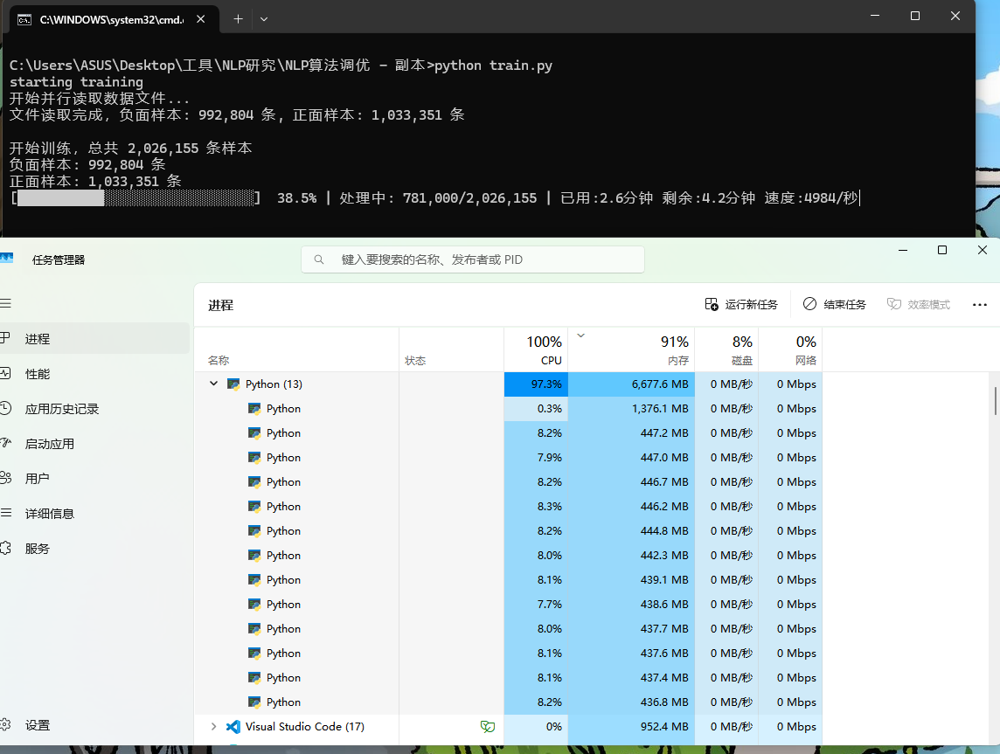

# SnowNLP-tuning
基于py语言的朴素贝叶斯分类器snowNLP算法调整

### 作者邮箱：a3436533165@163.com

### 使用方法与文件介绍
【文件夹】根目录
1. 目录下方的 snowNLP 是修改后的 snowNLP 模块。
2. train.py 用于训练模型，运行即可进行训练，训练结果将保存在 train.py 的运行目录下。
3. data文件夹用于存放正面、负面训练数据，neg.txt 与 pos.txt。
4. mode 文件夹用于存放模型文件，提供给 continue.py 继续增量训练模型训练使用。

【文件夹】训练集生成
1. 段落文本批量预测工具.py 用于给data.txt文件中的内容分成每一句，然后调用sonwnlp进行初步标注，并将结果放置在  预测标注生成的数据.txt  文件中

【文件夹】模型测试
1. bert-snownlp-Mixed（组合预测）.py  对 bert 与 snowNLP 算法进行调整，进行一定的语义理解与修饰分析，降低了句子误判问题。

### 调整详细（中文）
version 1.0
优化了训练调用的输出信息：显示传入的正面、负面数据量，并对错误数据剔除，显示当前训练已用时间、训练时间花费的估计与当前训练的速度.
由于朴素贝叶斯算法是CPU密集型任务，因此使用了多进程与进程池提高训练速度
 （根据自己的设备测试结果得出，基于不变的200w条训练数据量而言，修改后的模块相比较于原 来的模块的训练速度快3倍）。
增加方法：自定义 叶斯分类器方法，提供给 continue.py 继续训练使用。

version: 2.0
 优化：调整了线程的使用解决了抢占问题导致的训练速度逐渐下降的问题，速度突破12000条数据每秒，相较原版的snowNLP模块有了20倍提升。
使用transform架构调用bert和snownlp混合预测，使用算法找出核心修饰词与描述关联关系。（BERT 语义分析模型下载： https://huggingface.co/google-bert/bert-base-chinese）
使用transfrom架构调用ber模型，对句子核心部分进行分析（注意力机制），生成各层注意力权重，创建token到其注意力权重的映射。
识别否定词与转折关系，并生成核心修饰词与描述关联关系。并对标点符号进行检测，分析讽刺语义关系（例如：很厉害？），解决否定误判问题。
使用缓存机制，加速模型判断速度。

### 贝叶斯方法
      贝叶斯方法是以贝叶斯原理为基础，使用概率统计的知识对样本数据集进行分类。由于其有
    坚实的数学基础，贝叶斯分类算法的误判率是很低的。贝叶斯方法的特点是结合先验概率和
    概率，即避免了只使用先验概率的主观偏见，也避免了单独使用样本信息的过拟合现象。叶
    斯分类算法在数据集较大的情况下表现出较高的准确率，同时算法本身也比较简单。

### Introduction to usage and documentation
1. The snowNLP below the directory is the modified snowNLP module.
2. train.py is used to train the model, and the training results will be saved in the train.py run directory.
3. The data folder is used to store positive and negative training data, neg.txt and pos.txt.
4. The mode folder is used to store the model files and is provided for continue.py to continue training the incremental training model.
5. Automatic training.py loads the model under the snownlp module to predict and annotate the data.txt (the content can be various text paragraphs in different formats, they will be broken down into sentences) and save the results to the res.txt.

### Adjustment Details (English)
1. Optimized the output information of training calls: display the amount of incoming positive and negative data, and exclude erroneous data, showing the current training time, the estimated training time spent and the current training speed.
2. Since the naïve Bayesian algorithm is a CPU-intensive task, multi-process and process pools are used to improve the training speed
(According to the test results of its own equipment, based on the unchanged 200w training data volume, the modified module is 3 times faster than the original module).
3. Add methods: Customize the Yeth classifier method for continue.py to continue training and use.

### Bayesian Method
Bayesian methods are based on Bayesian principles and use knowledge of probability statistics to classify sample datasets. Because of its existence
With a solid mathematical foundation, the misjudgment rate of Bayesian classification algorithms is very low. Bayesian methods are characterized by combining a priori probability sum
Probability, that is, it avoids the subjective bias of using only a priori probability and the overfitting phenomenon of using sample information alone. leaf
The classification algorithm shows high accuracy in the case of large datasets, and the algorithm itself is relatively simple.